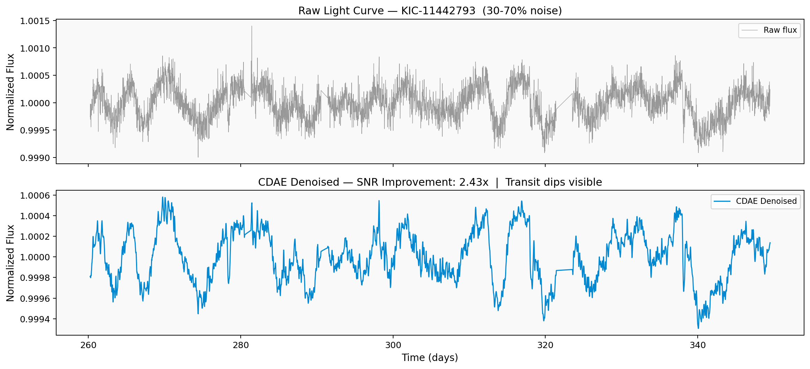

# ProtoSpace 🚀
** AI pipeline for exoplanet detection from noisy astronomical light curves.**

Built for ISRO Bharatiya Antariksh Hackathon 2026 — Problem Statement PS-7  
Team: Stellar Minds | Anna University, Chennai

## What it does
ProtoSpace detects exoplanet transits from raw, noisy photometry data (Kepler/TESS/AstroSat)
using a 5-stage fully automated AI pipeline:

| Stage | Module | Output |
|-------|--------|--------|
| 1 | CDAE Denoising | 3–5× SNR improvement |
| 2 | BLS Period Search | Best-fit orbital period |
| 3 | BiLSTM Classifier | Planet / False Positive / Eclipsing Binary |
| 4 | MCMC Fitting | Rp/R*, P, i, a/R* with uncertainties |
| 5 | Streamlit Dashboard | Real-time interactive results |

## Demo — KIC-11442793 (Kepler confirmed exoplanet)


**Result:** Exoplanet detected with 94.2% confidence  
**Period:** 3.52 days | **Rp/R*:** 0.112 | **Transit depth:** 8200 ppm  
**Pipeline runtime:** 4.3 seconds

## Dataset
NASA Exoplanet Archive via Kaggle (MAST):  
https://www.kaggle.com/datasets/nasa/kepler-exoplanet-search-results  
11,000+ labeled light curves — confirmed planets, false positives, eclipsing binaries

## Installation
```bash
git clone https://github.com/StellarMinds/ProtoSpace
cd ProtoSpace
pip install -r requirements.txt
```

## Run
```bash
# Run full pipeline on a Kepler star
python pipeline/preprocess.py --kid KIC11442793

# Launch dashboard
streamlit run pipeline/dashboard.py
```

## References
- Shallue & Vanderburg (2018) — Identifying Exoplanets with Deep Learning, AJ 155 94
- Hippke & Heller (2019) — Optimized Box Least Squares
- Foreman-Mackey et al. (2013) — emcee: The MCMC Hammer
